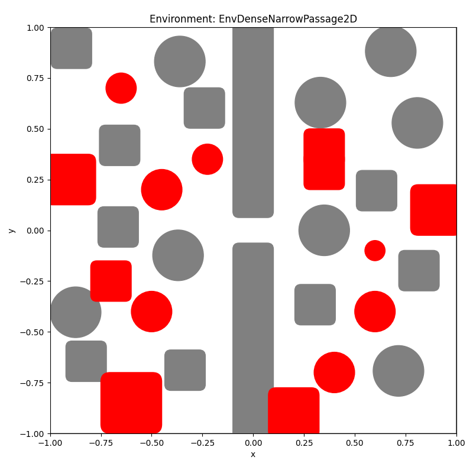
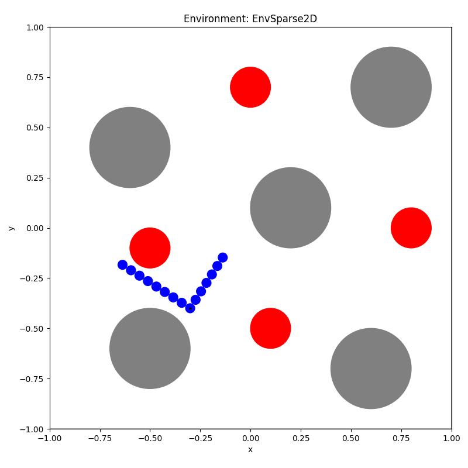

# MPD-S (Motion Planning Diffusion - Shortcut)
Novel motion planning algorithm that combines diffusion models and shortcut models

Installation:
```
uv sync
./.venv/Scripts/activate
pip install -e .

```

Usage:
We provide 3 scripts for data generation, inference and training.
All the parameters can be changed in config.py or via command line arguments

---
## Experiments

## RobotSphere2D

### EnvSimple2D


#### Base

| algorithm               | success_rate   | time          | avg_free_trajectories   | avg_free_points   | path_length_best   | avg_path_length   | avg_ISJ                  | waypoints_stddev   |
|:------------------------|:---------------|:--------------|:------------------------|:------------------|:-------------------|:------------------|:-------------------------|:-------------------|
| gpmp2                   | 99.50 ± 0.50   | 2.770 ± 0.009 | 99.50 ± 0.01            | 99.97 ± 0.00      | 1.7722 ± 0.0240    | 1.7731 ± 0.0238   | 65.8050 ± 6.3360         | 0.0000 ± 0.0000    |
| grad                    | 73.67 ± 5.00   | 0.962 ± 0.007 | 73.33 ± 0.05            | 99.00 ± 0.00      | 1.8568 ± 0.0298    | 1.8575 ± 0.0296   | 30698.6974 ± 1336.1295   | 0.0000 ± 0.0000    |
| grad-splines            | 99.50 ± 0.50   | 1.022 ± 0.003 | 99.50 ± 0.01            | 99.99 ± 0.00      | 1.7725 ± 0.0244    | 1.7728 ± 0.0241   | 6.7795 ± 0.6213          | 0.0000 ± 0.0000    |
| rrtconnect              | 100.00 ± 0.00  | 0.620 ± 0.041 | 99.70 ± 0.00            | 100.00 ± 0.00     | 1.9279 ± 0.0291    | 2.6477 ± 0.0388   | 697444.5093 ± 10704.7196 | 0.0234 ± 0.0008    |
| rrtconnect-spline       | 100.00 ± 0.00  | 1.388 ± 0.094 | 89.50 ± 0.01            | 99.66 ± 0.00      | 1.8393 ± 0.0257    | 2.3451 ± 0.0351   | 409.6015 ± 38.0385       | 0.0327 ± 0.0011    |
| rrtconnect-gpmp2        | 100.00 ± 0.00  | 3.244 ± 0.031 | 99.99 ± 0.00            | 100.00 ± 0.00     | 1.7592 ± 0.0234    | 1.9236 ± 0.0276   | 5.7036 ± 0.4621          | 0.0137 ± 0.0008    |
| rrtconnect-grad         | 100.00 ± 0.00  | 1.505 ± 0.032 | 99.97 ± 0.00            | 100.00 ± 0.00     | 1.9367 ± 0.0244    | 2.4311 ± 0.0312   | 46055.1505 ± 921.3174    | 0.0325 ± 0.0011    |
| rrtconnect-grad-splines | 100.00 ± 0.00  | 1.601 ± 0.033 | 100.00 ± 0.00           | 100.00 ± 0.00     | 1.7731 ± 0.0233    | 2.0613 ± 0.0270   | 11.3433 ± 0.4370         | 0.0274 ± 0.0010    |
| mpd                     | 100.00 ± 0.00  | 0.446 ± 0.006 | 98.74 ± 0.00            | 99.99 ± 0.00      | 1.8418 ± 0.0255    | 2.2170 ± 0.0305   | 2277.8920 ± 346.1424     | 0.0284 ± 0.0010    |
| mpd-reimpl              | 100.00 ± 0.00  | 0.379 ± 0.008 | 98.86 ± 0.00            | 99.97 ± 0.00      | 1.7801 ± 0.0229    | 1.9351 ± 0.0271   | 1823.4021 ± 144.0529     | 0.0100 ± 0.0006    |
| mpd-splines-reimpl      | 100.00 ± 0.00  | 0.094 ± 0.002 | 93.25 ± 0.01            | 99.70 ± 0.00      | 1.7801 ± 0.0236    | 1.9411 ± 0.0281   | 48.9238 ± 5.2765         | 0.0090 ± 0.0006    |
| drmp (ours)             | 100.00 ± 0.00  | 0.016 ± 0.001 | 86.99 ± 0.02            | 99.44 ± 0.00      | 1.7900 ± 0.0236    | 1.9679 ± 0.0283   | 103.0449 ± 7.1893        | 0.0103 ± 0.0007    |

#### Extra objects

| algorithm               | success_rate   | time          | avg_free_trajectories   | avg_free_points   | path_length_best   | avg_path_length   | avg_ISJ                  | waypoints_stddev   |
|:------------------------|:---------------|:--------------|:------------------------|:------------------|:-------------------|:------------------|:-------------------------|:-------------------|
| gpmp2                   | 66.50 ± 5.50   | 3.528 ± 0.032 | 64.73 ± 0.05            | 99.09 ± 0.00      | 1.8416 ± 0.0285    | 1.8428 ± 0.0285   | 194.7415 ± 28.3457       | 0.0000 ± 0.0000    |
| grad                    | 34.67 ± 5.33   | 1.160 ± 0.008 | 34.67 ± 0.05            | 96.84 ± 0.00      | 1.9505 ± 0.0380    | 1.9509 ± 0.0382   | 39198.8847 ± 1232.7769   | 0.0000 ± 0.0000    |
| grad                    | 61.00 ± 5.67   | 1.188 ± 0.007 | 61.00 ± 0.05            | 99.21 ± 0.00      | 1.8550 ± 0.0307    | 1.8557 ± 0.0306   | 37.3256 ± 6.6706         | 0.0000 ± 0.0000    |
| rrtconnect              | 100.00 ± 0.00  | 4.212 ± 0.264 | 98.01 ± 0.00            | 100.00 ± 0.00     | 2.1806 ± 0.0374    | 3.0325 ± 0.0455   | 866191.6630 ± 13439.4724 | 0.0381 ± 0.0010    |
| rrtconnect-spline       | 100.00 ± 0.00  | 2.653 ± 0.099 | 68.95 ± 0.01            | 99.24 ± 0.00      | 2.0376 ± 0.0319    | 2.6450 ± 0.0401   | 2915.7466 ± 232.0497     | 0.0400 ± 0.0012    |
| rrtconnect-gpmp2        | 100.00 ± 0.00  | 7.619 ± 0.379 | 99.92 ± 0.00            | 100.00 ± 0.00     | 1.9253 ± 0.0279    | 2.2691 ± 0.0370   | 40.1214 ± 3.1768         | 0.0279 ± 0.0010    |
| rrtconnect-grad         | 100.00 ± 0.00  | 4.710 ± 0.427 | 98.46 ± 0.00            | 99.99 ± 0.00      | 2.1836 ± 0.0298    | 2.7825 ± 0.0399   | 33766.7393 ± 348.9461    | 0.0416 ± 0.0011    |
| rrtconnect-grad-splines | 100.00 ± 0.00  | 4.691 ± 0.370 | 99.93 ± 0.00            | 100.00 ± 0.00     | 1.9513 ± 0.0287    | 2.3343 ± 0.0366   | 35.7235 ± 2.3047         | 0.0350 ± 0.0010    |
| mpd                     | 78.00 ± 4.67   | 0.483 ± 0.007 | 13.53 ± 0.02            | 97.83 ± 0.00      | 2.0764 ± 0.0442    | 2.3086 ± 0.0413   | 34903.0034 ± 4029.0827   | 0.0193 ± 0.0019    |
| mpd-reimpl              | 75.33 ± 5.00   | 0.384 ± 0.005 | 19.52 ± 0.02            | 96.02 ± 0.00      | 1.9448 ± 0.0326    | 2.0489 ± 0.0315   | 10279.8924 ± 699.8365    | 0.0067 ± 0.0008    |
| mpd-smplines-reimpl     | 72.66 ± 5.00   | 0.094 ± 0.002 | 16.09 ± 0.02            | 93.72 ± 0.00      | 1.9384 ± 0.0347    | 2.0508 ± 0.0358   | 185.4848 ± 12.4824       | 0.0063 ± 0.0007    |
| drmp (ours)             | 73.33 ± 5.00   | 0.018 ± 0.001 | 14.60 ± 0.02            | 93.65 ± 0.00      | 1.9558 ± 0.0357    | 2.0708 ± 0.0359   | 271.4795 ± 14.5528       | 0.0067 ± 0.0007    |

### EnvDense2D


#### Base

| algorithm               | success_rate   | time          | avg_free_trajectories   | avg_free_points   | path_length_best   | avg_path_length   | avg_ISJ                  | waypoints_stddev   |
|:------------------------|:---------------|:--------------|:------------------------|:------------------|:-------------------|:------------------|:-------------------------|:-------------------|
| gpmp2                   | 56.67 ± 5.67   | 2.953 ± 0.023 | 51.04 ± 0.06            | 98.70 ± 0.00      | 1.8292 ± 0.0299    | 1.8296 ± 0.0303   | 321.7846 ± 59.7824       | 0.0000 ± 0.0000    |
| grad                    | 20.83 ± 4.50   | 0.977 ± 0.003 | 20.83 ± 0.05            | 96.07 ± 0.00      | 1.9353 ± 0.0449    | 1.9362 ± 0.0453   | 39343.7655 ± 1915.5974   | 0.0000 ± 0.0000    |
| grad-splines            | 47.33 ± 5.67   | 1.036 ± 0.003 | 47.33 ± 0.06            | 98.79 ± 0.00      | 1.8310 ± 0.0343    | 1.8307 ± 0.0340   | 48.7880 ± 10.1116        | 0.0000 ± 0.0000    |
| rrtconnect              | 100.00 ± 0.00  | 2.919 ± 0.145 | 97.54 ± 0.00            | 99.99 ± 0.00      | 2.2110 ± 0.0426    | 3.1077 ± 0.0522   | 880801.0992 ± 15760.4837 | 0.0413 ± 0.0013    |
| rrtconnect-spline       | 100.00 ± 0.00  | 2.761 ± 0.107 | 56.09 ± 0.01            | 99.03 ± 0.00      | 2.0583 ± 0.0380    | 2.6968 ± 0.0453   | 4340.0094 ± 397.5339     | 0.0440 ± 0.0014    |
| rrtconnect-gpmp2        | 100.00 ± 0.00  | 5.806 ± 0.110 | 98.64 ± 0.00            | 99.99 ± 0.00      | 1.9234 ± 0.0289    | 2.2805 ± 0.0370   | 60.4706 ± 4.2583         | 0.0327 ± 0.0010    |
| rrtconnect-grad         | 100.00 ± 0.00  | 4.164 ± 0.114 | 96.29 ± 0.00            | 99.97 ± 0.00      | 2.1950 ± 0.0334    | 2.7995 ± 0.0419   | 34494.6215 ± 264.6732    | 0.0440 ± 0.0012    |
| rrtconnect-grad-splines | 100.00 ± 0.00  | 4.799 ± 0.186 | 99.84 ± 0.00            | 100.00 ± 0.00     | 1.9486 ± 0.0295    | 2.3510 ± 0.0380   | 56.4135 ± 3.8072         | 0.0368 ± 0.0010    |
| mpd                     | 85.50 ± 3.83   | 0.428 ± 0.005 | 17.95 ± 0.02            | 98.15 ± 0.00      | 2.2695 ± 0.0441    | 2.4836 ± 0.0444   | 48994.3006 ± 3864.6963   | 0.0104 ± 0.0008    |
| mpd-reimpl              | 100.00 ± 0.00  | 0.279 ± 0.005 | 83.30 ± 0.01            | 99.65 ± 0.00      | 1.9971 ± 0.0323    | 2.4070 ± 0.0417   | 8902.2571 ± 309.9196     | 0.0337 ± 0.0011    |
| mpd-smplines-reimpl     | 100.00 ± 0.00  | 0.100 ± 0.001 | 63.60 ± 0.02            | 98.17 ± 0.00      | 2.0032 ± 0.0357    | 2.3339 ± 0.0418   | 125.4364 ± 6.9123        | 0.0251 ± 0.0010    |
| drmp (ours)             | 100.00 ± 0.00  | 0.016 ± 0.001 | 44.70 ± 0.02            | 96.54 ± 0.00      | 2.0279 ± 0.0333    | 2.3608 ± 0.0380   | 272.8689 ± 10.6249       | 0.0290 ± 0.0011    |

#### Extra objects

| algorithm               | success_rate   | time           | avg_free_trajectories   | avg_free_points   | path_length_best   | avg_path_length   | avg_ISJ                  | waypoints_stddev   |
|:------------------------|:---------------|:---------------|:------------------------|:------------------|:-------------------|:------------------|:-------------------------|:-------------------|
| gpmp2                   | 43.00 ± 5.67   | 3.373 ± 0.045  | 34.78 ± 0.05            | 98.47 ± 0.00      | 1.8475 ± 0.0338    | 1.8484 ± 0.0337   | 562.9151 ± 90.1467       | 0.0000 ± 0.0000    |
| grad                    | 11.17 ± 3.50   | 1.888 ± 0.009  | 11.17 ± 0.04            | 95.23 ± 0.00      | 1.8990 ± 0.0619    | 1.8976 ± 0.0630   | 41783.8342 ± 2469.0239   | 0.0000 ± 0.0000    |
| grad-splines            | 30.50 ± 5.17   | 2.014 ± 0.010  | 29.64 ± 0.05            | 98.46 ± 0.00      | 1.8874 ± 0.0482    | 1.8899 ± 0.0487   | 83.7913 ± 25.1863        | 0.0000 ± 0.0000    |
| rrtconnect              | 100.00 ± 0.00  | 6.899 ± 0.408  | 97.00 ± 0.00            | 99.99 ± 0.00      | 2.2951 ± 0.0395    | 3.2228 ± 0.0472   | 901428.9441 ± 12860.6889 | 0.0512 ± 0.0012    |
| rrtconnect-spline       | 100.00 ± 0.00  | 5.823 ± 0.261  | 45.18 ± 0.01            | 98.88 ± 0.00      | 2.1346 ± 0.0359    | 2.7575 ± 0.0435   | 8118.3568 ± 671.2641     | 0.0475 ± 0.0015    |
| rrtconnect-gpmp2        | 100.00 ± 0.00  | 10.869 ± 0.543 | 96.56 ± 0.00            | 99.98 ± 0.00      | 1.9740 ± 0.0272    | 2.3826 ± 0.0327   | 119.1933 ± 6.7214        | 0.0425 ± 0.0012    |
| rrtconnect-grad         | 100.00 ± 0.00  | 11.627 ± 0.650 | 89.47 ± 0.01            | 99.90 ± 0.00      | 2.2374 ± 0.0316    | 2.8261 ± 0.0363   | 35731.7650 ± 153.4618    | 0.0489 ± 0.0014    |
| rrtconnect-grad-splines | 100.00 ± 0.00  | 9.572 ± 0.859  | 99.19 ± 0.00            | 100.00 ± 0.00     | 2.0010 ± 0.0282    | 2.4551 ± 0.0345   | 103.0706 ± 6.3499        | 0.0440 ± 0.0012    |
| mpd                     | 86.83 ± 3.83   | 0.514 ± 0.003  | 15.80 ± 0.02            | 98.10 ± 0.00      | 2.3411 ± 0.0493    | 2.5388 ± 0.0465   | 60279.4413 ± 3377.2777   | 0.0107 ± 0.0008    |
| mpd-reimpl              | 98.83 ± 1.17   | 0.284 ± 0.004  | 29.84 ± 0.02            | 98.28 ± 0.00      | 2.0516 ± 0.0295    | 2.3423 ± 0.0316   | 16121.2264 ± 541.0624    | 0.0295 ± 0.0016    |
| mpd-smplines-reimpl     | 98.17 ± 1.50   | 0.093 ± 0.002  | 19.81 ± 0.02            | 93.84 ± 0.00      | 2.0671 ± 0.0332    | 2.2965 ± 0.0346   | 243.6064 ± 10.8707       | 0.0194 ± 0.0015    |
| drmp (ours)             | 98.50 ± 1.17   | 0.018 ± 0.001  | 15.95 ± 0.01            | 92.78 ± 0.00      | 2.0841 ± 0.0314    | 2.2859 ± 0.0313   | 321.9948 ± 12.2196       | 0.0206 ± 0.0016    |

### EnvDenseNarrowPassage2D



#### Base

| algorithm               | success_rate   | time           | avg_free_trajectories   | avg_free_points   | path_length_best   | avg_path_length   | avg_ISJ                  | waypoints_stddev   |
|:------------------------|:---------------|:---------------|:------------------------|:------------------|:-------------------|:------------------|:-------------------------|:-------------------|
| gpmp2                   | 35.33 ± 5.33   | 2.885 ± 0.008  | 35.33 ± 0.05            | 98.55 ± 0.00      | 1.8620 ± 0.0498    | 1.8615 ± 0.0501   | 116.7972 ± 17.4736       | 0.0000 ± 0.0000    |
| grad                    | 15.67 ± 4.00   | 1.067 ± 0.012  | 15.83 ± 0.04            | 95.43 ± 0.00      | 1.9512 ± 0.0658    | 1.9510 ± 0.0649   | 34986.7758 ± 1443.4563   | 0.0000 ± 0.0000    |
| grad-splines            | 36.00 ± 5.33   | 1.074 ± 0.011  | 35.83 ± 0.05            | 98.42 ± 0.00      | 1.8640 ± 0.0508    | 1.8640 ± 0.0504   | 10.2190 ± 2.0291         | 0.0000 ± 0.0000    |
| rrtconnect              | 100.00 ± 0.00  | 8.130 ± 0.498  | 99.03 ± 0.00            | 100.00 ± 0.00     | 2.2339 ± 0.0400    | 3.0265 ± 0.0494   | 857212.2081 ± 14602.1589 | 0.0263 ± 0.0008    |
| rrtconnect-spline       | 100.00 ± 0.00  | 5.974 ± 0.424  | 71.95 ± 0.01            | 99.39 ± 0.00      | 2.0779 ± 0.0339    | 2.6440 ± 0.0422   | 2408.1137 ± 224.8312     | 0.0265 ± 0.0007    |
| rrtconnect-gpmp2        | 100.00 ± 0.00  | 10.078 ± 1.641 | 94.41 ± 0.02            | 99.99 ± 0.00      | 1.9402 ± 0.0280    | 2.1626 ± 0.0322   | 28.8911 ± 2.1500         | 0.0171 ± 0.0006    |
| rrtconnect-grad         | 100.00 ± 0.00  | 8.688 ± 1.792  | 93.98 ± 0.02            | 99.99 ± 0.00      | 2.1911 ± 0.0321    | 2.7419 ± 0.0385   | 33762.8483 ± 602.1265    | 0.0276 ± 0.0007    |
| rrtconnect-grad-splines | 100.00 ± 0.00  | 8.832 ± 1.939  | 95.10 ± 0.02            | 100.00 ± 0.00     | 1.9638 ± 0.0292    | 2.2559 ± 0.0326   | 31.7671 ± 2.8299         | 0.0205 ± 0.0006    |
| mpd                     | 98.17 ± 1.50   | 0.417 ± 0.003  | 90.44 ± 0.03            | 99.73 ± 0.00      | 1.9654 ± 0.0298    | 2.1459 ± 0.0303   | 4411.1169 ± 1429.7138    | 0.0117 ± 0.0005    |
| mpd-reimpl              | 99.50 ± 0.50   | 0.294 ± 0.005  | 92.94 ± 0.02            | 99.71 ± 0.00      | 1.9834 ± 0.0319    | 2.1629 ± 0.0324   | 3384.9187 ± 288.7196     | 0.0120 ± 0.0005    |
| mpd-smplines-reimpl     | 98.83 ± 1.17   | 0.091 ± 0.002  | 88.45 ± 0.02            | 99.25 ± 0.00      | 1.9707 ± 0.0307    | 2.1446 ± 0.0311   | 68.8103 ± 5.7314         | 0.0106 ± 0.0004    |
| drmp (ours)             | 99.50 ± 0.50   | 0.016 ± 0.001  | 81.92 ± 0.02            | 98.82 ± 0.00      | 1.9756 ± 0.0311    | 2.1716 ± 0.0315   | 120.8311 ± 7.2181        | 0.0117 ± 0.0005    |

#### Extra objects

| algorithm               | success_rate   | time           | avg_free_trajectories   | avg_free_points   | path_length_best   | avg_path_length   | avg_ISJ                  | waypoints_stddev   |
|:------------------------|:---------------|:---------------|:------------------------|:------------------|:-------------------|:------------------|:-------------------------|:-------------------|
| gpmp2                   | 33.33 ± 5.33   | 3.390 ± 0.010  | 33.33 ± 0.05            | 97.51 ± 0.00      | 1.8710 ± 0.0399    | 1.8714 ± 0.0410   | 181.6919 ± 21.1022       | 0.0000 ± 0.0000    |
| grad                    | 12.83 ± 3.83   | 1.079 ± 0.002  | 12.83 ± 0.04            | 93.78 ± 0.00      | 2.0397 ± 0.0724    | 2.0378 ± 0.0722   | 41184.4318 ± 1607.2371   | 0.0000 ± 0.0000    |
| grad-splines            | 37.50 ± 5.50   | 1.370 ± 0.018  | 37.50 ± 0.05            | 97.67 ± 0.00      | 1.8809 ± 0.0405    | 1.8820 ± 0.0403   | 26.4692 ± 5.4555         | 0.0000 ± 0.0000    |
| rrtconnect              | 82.83 ± 4.17   | 18.398 ± 3.149 | 97.71 ± 0.00            | 99.99 ± 0.00      | 2.2459 ± 0.0401    | 2.9491 ± 0.0568   | 864134.5516 ± 17450.3788 | 0.0246 ± 0.0010    |
| rrtconnect-spline       | 82.83 ± 4.17   | 18.843 ± 3.235 | 60.11 ± 0.02            | 99.16 ± 0.00      | 2.0945 ± 0.0362    | 2.5793 ± 0.0484   | 4611.3917 ± 462.0190     | 0.0217 ± 0.0008    |
| rrtconnect-gpmp2        | 84.17 ± 4.17   | 19.654 ± 2.942 | 98.28 ± 0.01            | 100.00 ± 0.00     | 1.9154 ± 0.0296    | 2.1250 ± 0.0380   | 56.0280 ± 6.0765         | 0.0136 ± 0.0007    |
| rrtconnect-grad         | 84.17 ± 4.17   | 16.188 ± 2.552 | 94.80 ± 0.01            | 99.96 ± 0.00      | 2.1458 ± 0.0337    | 2.5997 ± 0.0439   | 34579.9367 ± 471.6204    | 0.0207 ± 0.0007    |
| rrtconnect-grad-splines | 84.17 ± 4.17   | 20.677 ± 3.171 | 98.63 ± 0.01            | 100.00 ± 0.00     | 1.9355 ± 0.0306    | 2.1792 ± 0.0388   | 46.4957 ± 5.3483         | 0.0157 ± 0.0006    |
| mpd                     | 82.33 ± 4.33   | 0.551 ± 0.003  | 50.57 ± 0.04            | 99.26 ± 0.00      | 1.9777 ± 0.0292    | 2.1478 ± 0.0297   | 24885.3383 ± 2462.0130   | 0.0100 ± 0.0005    |
| mpd-reimpl              | 82.00 ± 4.33   | 0.302 ± 0.004  | 32.22 ± 0.03            | 98.42 ± 0.00      | 1.9927 ± 0.0337    | 2.1183 ± 0.0358   | 12919.6824 ± 1031.1339   | 0.0078 ± 0.0006    |
| mpd-smplines-reimpl     | 76.50 ± 4.83   | 0.095 ± 0.002  | 28.26 ± 0.03            | 95.62 ± 0.00      | 1.9960 ± 0.0370    | 2.0902 ± 0.0369   | 168.7034 ± 13.7743       | 0.0052 ± 0.0005    |
| drmp (ours)             | 76.83 ± 4.83   | 0.017 ± 0.001  | 27.00 ± 0.03            | 95.34 ± 0.00      | 2.0032 ± 0.0380    | 2.1122 ± 0.0361   | 237.7012 ± 15.2860       | 0.0061 ± 0.0006    |

## RobotL2D

### EnvSparse2D



#### Base

| algorithm               | success_rate   | time          | avg_free_trajectories   | avg_free_points   | path_length_best   | avg_path_length   | avg_ISJ                      | waypoints_stddev   |
|:------------------------|:---------------|:--------------|:------------------------|:------------------|:-------------------|:------------------|:-----------------------------|:-------------------|
| grad                    | 2.17 ± 1.50    | 4.312 ± 0.038 | 2.17 ± 0.01             | 56.29 ± 0.02      | 2.4043 ± 0.1397    | 2.4067 ± 0.1405   | 4033016.0000 ± 125282.4583   | 0.0000 ± 0.0000    |
| grad-splines            | 50.67 ± 5.67   | 4.361 ± 0.033 | 50.29 ± 0.06            | 98.15 ± 0.00      | 2.5565 ± 0.0908    | 2.5582 ± 0.0889   | 14015.4141 ± 448.6696        | 0.0000 ± 0.0000    |
| rrtconnect              | 100.00 ± 0.00  | 2.196 ± 0.407 | 99.98 ± 0.00            | 100.00 ± 0.00     | 2.7950 ± 0.0689    | 4.0540 ± 0.0990   | 41509113.1758 ± 1046877.6642 | 0.0326 ± 0.0019    |
| rrtconnect-spline       | 100.00 ± 0.00  | 2.262 ± 0.405 | 99.89 ± 0.00            | 99.99 ± 0.00      | 2.5575 ± 0.0604    | 3.5547 ± 0.0869   | 11367.8479 ± 1742.9271       | 0.0329 ± 0.0022    |
| rrtconnect-grad         | 100.00 ± 0.00  | 6.339 ± 0.456 | 99.89 ± 0.00            | 99.99 ± 0.00      | 2.9283 ± 0.0513    | 3.8244 ± 0.0760   | 2358923.6162 ± 47401.6670    | 0.0329 ± 0.0022    |
| rrtconnect-grad-splines | 100.00 ± 0.00  | 6.419 ± 0.448 | 99.67 ± 0.00            | 100.00 ± 0.00     | 2.6270 ± 0.0528    | 3.4871 ± 0.0720   | 13219.8087 ± 230.8026        | 0.0335 ± 0.0022    |
| mpd-reimpl              | 99.17 ± 0.83   | 0.366 ± 0.004 | 91.42 ± 0.02            | 99.52 ± 0.00      | 2.4962 ± 0.0539    | 3.0712 ± 0.0688   | 386862.0189 ± 34770.4653     | 0.0248 ± 0.0021    |
| mpd-splines-reimpl      | 98.83 ± 1.17   | 0.110 ± 0.002 | 76.61 ± 0.02            | 97.97 ± 0.00      | 2.4529 ± 0.0540    | 3.0056 ± 0.0687   | 10437.4670 ± 1524.5782       | 0.0219 ± 0.0018    |
| drmp (ours)             | 99.50 ± 0.50   | 0.036 ± 0.001 | 57.20 ± 0.02            | 95.53 ± 0.00      | 2.5306 ± 0.0566    | 3.1144 ± 0.0718   | 38365.3857 ± 7467.8262       | 0.0209 ± 0.0018    |

#### Extra objects
| algorithm               | success_rate   | time           | avg_free_trajectories   | avg_free_points   | path_length_best   | avg_path_length   | avg_ISJ                      | waypoints_stddev   |
|:------------------------|:---------------|:---------------|:------------------------|:------------------|:-------------------|:------------------|:-----------------------------|:-------------------|
| grad                    | 0.50 ± 0.50    | 5.563 ± 0.007  | 0.50 ± 0.01             | 37.77 ± 0.02      | -                  | -                 | -                            | -                  |
| grad-splines            | 5.17 ± 2.50    | 5.481 ± 0.005  | 5.17 ± 0.02             | 92.94 ± 0.00      | 2.3839 ± 0.1871    | 2.3882 ± 0.1889   | 13498.6925 ± 708.5607        | 0.0000 ± 0.0000    |
| rrtconnect              | 67.00 ± 5.33   | 61.041 ± 4.171 | 83.89 ± 0.03            | 99.20 ± 0.00      | 4.4084 ± 0.2002    | 5.8547 ± 0.2475   | 60311118.9774 ± 2427538.9040 | 0.0219 ± 0.0010    |
| rrtconnect-bsplines     | 67.00 ± 5.33   | 58.628 ± 3.488 | 73.81 ± 0.04            | 99.13 ± 0.00      | 4.1130 ± 0.1544    | 5.0678 ± 0.1772   | 2203384.8956 ± 60834.1580    | 0.0163 ± 0.0008    |
| rrtconnect-grad         | 67.00 ± 5.33   | 58.650 ± 3.460 | 78.59 ± 0.04            | 99.53 ± 0.00      | 3.6518 ± 0.1299    | 4.3976 ± 0.1397   | 18163.9567 ± 483.1098        | 0.0171 ± 0.0008    |
| rrtconnect-grad-splines | 67.00 ± 5.33   | 54.923 ± 3.583 | 83.60 ± 0.03            | 99.12 ± 0.00      | 3.9384 ± 0.1720    | 5.1115 ± 0.2140   | 687921.3311 ± 133986.4331    | 0.0175 ± 0.0008    |
| mpd-reimpl              | 12.17 ± 3.50   | 0.353 ± 0.002  | 0.76 ± 0.00             | 80.43 ± 0.01      | 3.1451 ± 0.2299    | 3.2760 ± 0.2018   | 1726135.0683 ± 620712.6040   | 0.0019 ± 0.0010    |
| mpd-splines-reimpl      | 3.83 ± 2.17    | 0.126 ± 0.002  | 0.17 ± 0.00             | 55.07 ± 0.01      | 2.3777 ± 0.2018    | 2.4924 ± 0.2115   | 7792.0549 ± 3639.7241        | 0.0007 ± 0.0004    |
| drmp (ours)             | 3.33 ± 2.00    | 0.047 ± 0.001  | 0.08 ± 0.00             | 51.52 ± 0.01      | 2.5525 ± 0.2726    | 2.6041 ± 0.2568   | 11639.9039 ± 4108.3258       | 0.0004 ± 0.0004    |
| drmp-grad-splines       | 15.83 ± 4.17   | 5.977 ± 0.046  | 0.50 ± 0.00             | 88.71 ± 0.00      | 2.8716 ± 0.1408    | 2.9247 ± 0.1337   | 9968.3573 ± 539.3666         | 0.0009 ± 0.0004    |

## Noise pred vs target pred

| algorithm               | success_rate   | time          | avg_free_trajectories   | avg_free_points   | path_length_best   | avg_path_length   | avg_ISJ                  | waypoints_stddev   |
|:------------------------|:---------------|:--------------|:------------------------|:------------------|:-------------------|:------------------|:-------------------------|:-------------------|
| diffusion_noise_pred    | 98.50 ± 1.17   | 0.286 ± 0.004 | 24.04 ± 0.01            | 95.38 ± 0.00      | 2.4395 ± 0.0251    | 2.6761 ± 0.0248   | 209.5542 ± 8.7648        | 0.0327 ± 0.0016    |
| diffusion_target_pred   | 97.83 ± 1.50   | 0.283 ± 0.004 | 19.24 ± 0.01            | 94.29 ± 0.00      | 2.4694 ± 0.0257    | 2.6656 ± 0.0243   | 269.9320 ± 9.6197        | 0.0268 ± 0.0015    |
| shortcut_noise_pred     | 100.00 ± 0.00  | 0.281 ± 0.004 | 24.41 ± 0.01            | 95.46 ± 0.00      | 2.4334 ± 0.0243    | 2.6514 ± 0.0229   | 200.5274 ± 7.8491        | 0.0317 ± 0.0016    |
| shortcut_target_pred    | 97.83 ± 1.50   | 0.284 ± 0.004 | 20.61 ± 0.01            | 94.47 ± 0.00      | 2.4638 ± 0.0258    | 2.6626 ± 0.0250   | 256.6386 ± 8.8320        | 0.0274 ± 0.0016    |

## Diffusion Shortcut vs Flow Matching Shortcut

| algorithm                      | success_rate   | time          | avg_free_trajectories   | avg_free_points   | path_length_best   | avg_path_length   | avg_ISJ                  | waypoints_stddev   |
|:-------------------------------|:---------------|:--------------|:------------------------|:------------------|:-------------------|:------------------|:-------------------------|:-------------------|
| diffusion shortcut 32 step     | 97.83 ± 1.50   | 0.284 ± 0.004 | 20.61 ± 0.01            | 94.47 ± 0.00      | 2.4638 ± 0.0258    | 2.6626 ± 0.0250   | 256.6386 ± 8.8320        | 0.0274 ± 0.0016    |
| flow matching shortcut 32 step | 100.00 ± 0.00  | 0.273 ± 0.004 | 24.53 ± 0.02            | 95.46 ± 0.00      | 2.4368 ± 0.0241    | 2.6605 ± 0.0240   | 222.6547 ± 8.8201        | 0.0308 ± 0.0016    |
| diffusion shortcut 1 step      | 95.83 ± 2.17   | 0.018 ± 0.001 | 13.20 ± 0.01            | 92.58 ± 0.00      | 2.4924 ± 0.0271    | 2.6644 ± 0.0258   | 357.6976 ± 11.5608       | 0.0219 ± 0.0016    |
| flow matching shortcut 1 step  | 85.17 ± 3.83   | 0.017 ± 0.001 | 4.18 ± 0.01             | 89.87 ± 0.00      | 2.6934 ± 0.0327    | 2.7974 ± 0.0305   | 3598.9359 ± 141.5922     | 0.0070 ± 0.0012    |

## Uniform vs Weighted at step 1

| algorithm                          | success_rate   | time          | avg_free_trajectories   | avg_free_points   | path_length_best   | avg_path_length   | avg_ISJ                  | waypoints_stddev   |
|:-----------------------------------|:---------------|:--------------|:------------------------|:------------------|:-------------------|:------------------|:-------------------------|:-------------------|
| diffusion shortcut uniform 1 step  | 97.67 ± 1.67   | 0.018 ± 0.001 | 14.62 ± 0.01            | 93.17 ± 0.00      | 2.4775 ± 0.0262    | 2.6627 ± 0.0256   | 331.3333 ± 10.4724       | 0.0257 ± 0.0016    |
| diffusion shortcut weighted 1 step | 95.83 ± 2.17   | 0.018 ± 0.001 | 13.20 ± 0.01            | 92.58 ± 0.00      | 2.4924 ± 0.0271    | 2.6644 ± 0.0258   | 357.6976 ± 11.5608       | 0.0219 ± 0.0016    |
